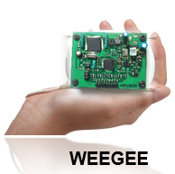
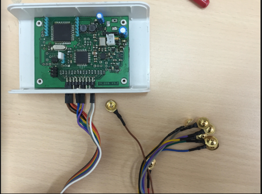
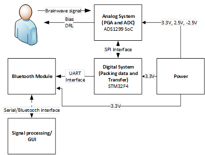
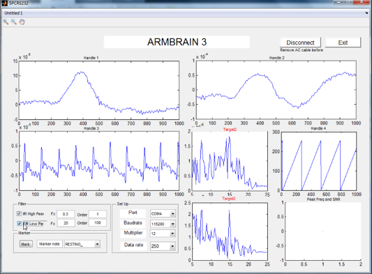
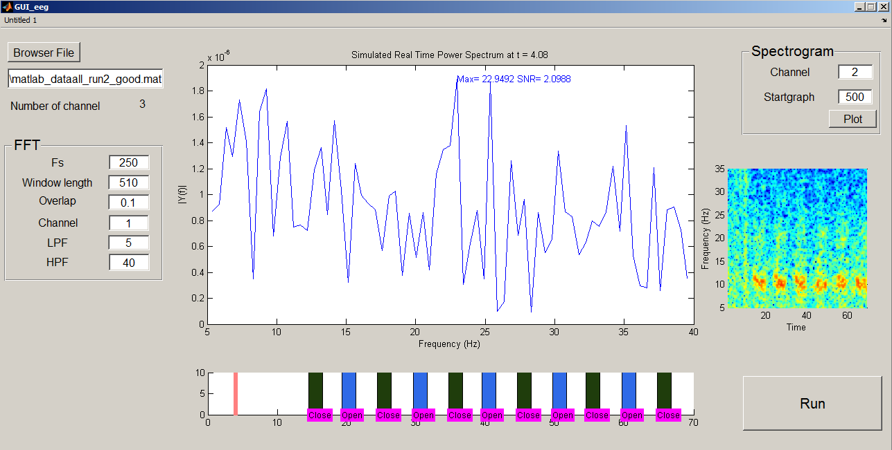
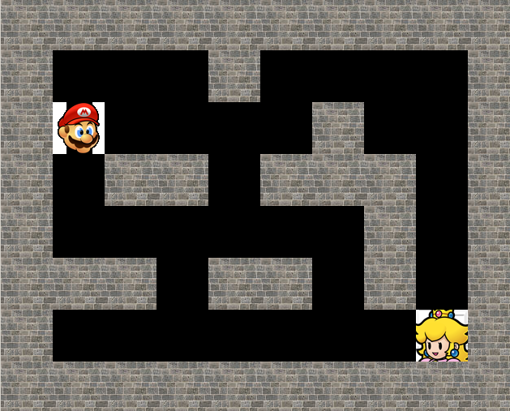

# WEEG SigPro
EEG processing software package for WEEG - a Wireless 8-channel EEG recording device, including:

- ***EEG recording and online processing GUI***
- ***Offline spectral analysis tool***

Other tools which will be released soon include:

- ***Stimulus design tool***
- ***A SSVEP-based BCI application***

## Briefly About WEEG
### Description
WEEG is a 24-bit 8-channel EEG system with integrated hardware and software interface. The device is based a new system-on-a-chip (SoC) to reduce circuitry components and be cost effective. Real-time view of 8-channel EEG data is also displayed. At this stage, our device’s prominent specifications include:

-	High compactness. The total area of 6.4 cm x 3.5 cm makes this device one of the most versatile EEG recording systems in its class.
-	Low cost. All the components that resemble the system are mass-produced and readily available in the market, making the total cost less than $200. This price is significantly lower than a traditional system which can cost up to thousands of U.S. dollars.
-	Wireless. Coupled with above characteristics, this platform also enables a broad range of applications that traditional systems are not capable of, e.g. ambulatory EEG recording. Another significant contribution would be providing unequipped hospitals an EEG recording platform which improve the current condition of diagnosing neural disorders.
-	24bit data precision from eight simultaneous channels. Existing low-cost EEG systems typically provide only 16-bit data precision. Better resolution leads to better data acquisition.
-	A remarkable wireless transfer rate at 500 Sample Per Second (SPS) for simultaneous eight channels. This data rate is excess the speed of other consumer grade EEG devices. Other applications transfer at 250 SPS or lower. [1]
-	A powerful microcontroller as the heart of the whole system. It can make the device standalone and powerful. Existing devices in the same class are not self-sustained; they have to be tethered to a computer.

### Overall Architecture
All circuit components are packed into a circuit board which is smaller than a regular smartphone size. Users can comfortably carry the device in a pouch holster all day long for monitoring activities if required. It consists an Arm Cortex M4 STM32F4 as the main microcontroller and the ADS1299 for Analog to Digital Converter (ADC) tasks. A 3.7V/1000mAh lithium polymer battery powers the whole system which draws approximately 30mA at steady state. This battery will last for 24 hours after fully charged.  A power management system is also included to charge the battery. Constant system voltage is maintained regardless input voltage from the battery by a buck/boost converter. The device communicates with a computer or a smartphone via Bluetooth or Serial interface. Real-time graphs of all channels are presented on the PC.

This system uses standard gold cup wet electrodes to acquire data. It has a distinct advantage in term of signal quality compares to dry electrode. This electrode terminal was made by a 0.1’ female header compare to a standard DIN Touch Proof Connector to save space on the Printed Circuit Board (PCB).

## EEG recording and online processing
Run WEEG_processing.m or simply type on command line:
    >> WEEG_processing

The following window appears

Click "Connect" button and system starts recording EEG signals.

On the top row, the GUI displays ongoing signals of 2 different channels (selected by users). On the below rows, we include data checking and spectral density function for observing frequency spectrum changes in realtime.

At the left-bottom corner, the filtering types (IIR and FIR) and correspondening parameters are left for user to tune depending on specific applications. The GUI also let user configure the serial communication with the device (WEEG).

## Offline processing tool - Spectral Analysis
The offline tool at the time being focuses on spectral processing. It helps explores data in the frequency domain for application like detection alpha wave, mu wave or any specific frequency as the response to periodic stimuli (Steady State Visually Evoked Potential - SSVEP). On the contrary, the processing of signal in time domain for application like Evoked-Related Potetial is not included.

The recommended procedure starts with the overall spectrogram plot (click "Plot" button) which shows the frequency spectrum over the whole time course of the experiment (see figure below). Only after that, we carefully inspects smaller chunk of signals and see how the spectrum was at one moment. The label of each event is displayed to determine if the brain signals behave accordingly to the experiment design, thus, verify our hypothesis.

To start offline spectral analysis run ./tools/spectral/Offline_SpectralAnalysis.m
Or if the main program has been launched, simply enter:
    >> Offline_SpectralAnalysis

The input data of the offline tool is a .mat file which contains a variable 'ALLEEG'. ALLEEG, following the data format of [EEGLAB](https://sccn.ucsd.edu/eeglab/), is a structure containing at least following fields:

    * data  <n x m> (double)  : EEG signals with n = number of channels, m = number of samples.
    * srate         (double)  : Sampling frequency
    * event <1 x k> (struct)  : contain info of the event series; each event structure contains:
      - latency (double): the sample point on which the event occurs, with respect to the beginning of a recording
      - type    (char)  : label of an event, e.g. "Eye Closed" or "Left Target", etc.

Sample data for this tool can be found in ./data/test alpha 5s/

## Stimuli design
(comming soon...)

## SSVEP-based BCI application
First, install [PyGame](http://www.pygame.org/download.shtml) (version 1.9.1)

Run
    > ./tools/SSVEP_BCIGame/FindPricess.py

The application is ready when console displays the message:
    > Waiting for connection...

Click "Connect" button within the TCP-IP panel of MATLAB's GUI to start playing game.

or
Run
    > ./tools/SSVEP_BCIGame/client_simulation.py

to simulate the game.

Check out this [video](https://youtu.be/-I-zIth_pqQ) to see how to connect 2 applications via TCP-IP and the [demo](https://www.youtube.com/watch?v=unTn2dZdzRU&feature=youtu.be) of playing puzzple game using WEEG (start from 2:10).

## Reference
[1] David Hairston, W., Whitaker, K.W., Ries, A.J., Vettel, J.M., Cortney Bradford, J., Kerick, S.E., and McDowell, K.: ‘Usability of four commercially-oriented EEG systems’, Journal of neural engineering, 2014, 11, (4), pp. 046018
